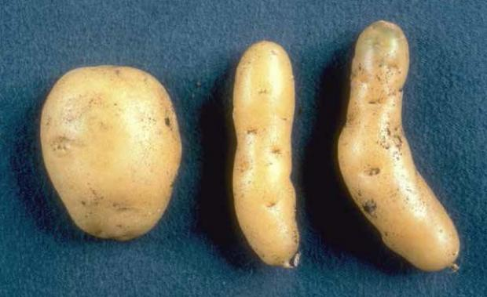

# Where are all the viroids?

## Benjamin Lee

Feburary 3rd, 2021

---

# What are viroids?

<!-- prettier-ignore-start -->

* Smallest known infectious pathogens <!--discovered in 1971 by TO Diener -->
* Genomes are 200-400 bp in size (~10,000 atoms)
* Uncapsidated circular ssRNA with no protein-coding capacity
* Replicate by repurposing host enzymes and by ribozymes formed by the genome itself
* Highly self complementary, forming rod-shaped or branched structures
* Two known families, *Pospiviroidae* and *Avsunviroidae*
* Generally infect plants and replicate in the nucleus or chloroplast, depending on family 

<!-- prettier-ignore-end -->

---



Dr. J. W. Roenhorst, NPPO-NL

<!-- universally fatal for cccvd -->

---


Diener, T.O. (1979). *Viroids and Viroid Diseases.*

<!-- t7 is 40,000 bases with pstvd is 359 -->

---

# Genome structure

- The members of _Pospiviroidae_ are rod shaped. For example, PSTVd:

  ```
          10        20         30        40        50         60          70        80          90        100        110       120       130        140       150       160       170
  CG     A    C        UGU    C-      GAC    U      AA    AAAA-         --|    A  AGC       GGA--   -     GAAAC-         A U   AAA     AC       A   C-  A    C  AC     UA  U    CC    C--     U
    GAACU AACU GUGGUUCC   GGUU  ACACCU   CUCC GAGCAG  AAGA     AGAAGGCGG  CUCGG GG   GCUUCAG     UCC CCGGG      CUGGAGCGA C GGC   AAAGG  GGUGGGG GUG  CC GCGG CG  AGGAG  AU CCCG  GAAA   AGGGU U
    CUUGG UUGA CGCCAAGG   CCGA  UGUGGG   GGGG UUCGUU  UUCU     UUUUUCGCC  GAGCC CU   CGAAGUC     AGG GGCCC      GGCUUCGCU G UCG   UUUCC  CCGCUCC CAC  GG CGCC GC  UCCUU  UG GGGC  CUUU   UCCCA U
  UC     -    -        UUC    UU      AGC    C      CA    AUCUC         AA^    -  ---       AACAA   U     AUCAUC         - -   CG-     C-       C   CA  A    C  GC     CC  U    UU    CCU     C
          350        340       330       320       310       300       290           280       270       260       250          240        230       220       210       200       190       180
  ```

- The members of _Avsunviroidae_ are branched or rod-shaped:
  
  Giguère, et al. (2014)

---

# Replication


---

# Replication (continued)


---

# Viroid taxonomy


ICTV 9th Report (2011)

<!-- Basically hasn't changed  -->

---

# Viroid-like RNA agents

- Virusoids
- Deltaviruses
- Satellite RNAs
- Retrozymes

---

# Where are all the viroids?

---

# 1KP

---

# Approach

---

# Results

| Metric           | NODE_33277                         | NODE_9161                  |
| ---------------- | ---------------------------------- | -------------------------- |
| Length           | 543 bp                             | 680 bp                     |
| GC content       | 63.1%                              | 42.5%                      |
| (+) Bases folded | 69.9%                              | 71.1%                      |
| (-) Bases folded | 74.4%                              | 67.0%                      |
| (+) MFE          | -326.47                            | -288.74                    |
| (-) MFE          | -347.57                            | -272.76                    |
| Host             | _Souroubea exauriculata_ (eudicot) | _Pteromonas_ (green algae) |
